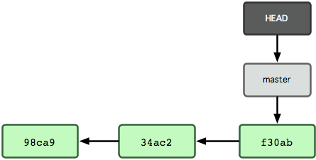

!SLIDE

# `HEAD` #

Points to where you are in the tree

!SLIDE

.notes HEAD is more interesting when there's more than one branch

# `HEAD` #

Points to where you are in the tree

!SLIDE

# `HEAD` #

`git checkout testing`

!SLIDE

# `HEAD` #

`git commit ...`

!SLIDE commandline incremental

## Lives in `.git/HEAD` ##

    $ cat .git/HEAD
      ref: refs/heads/master

    $ cat .git/refs/heads/master
      4f6a62b56396617d0894d7049e1da3dd59e4aa1c

    $ git log -1
      commit 4f6a62b56396617d0894d7049e1da3dd59e4aa1c
      Author: Kristján Pétursson <kristjan@gmail.com>
      Date:   Mon Oct 29 03:01:19 2012 -0700

!SLIDE

Don't screw with `.git/head`

